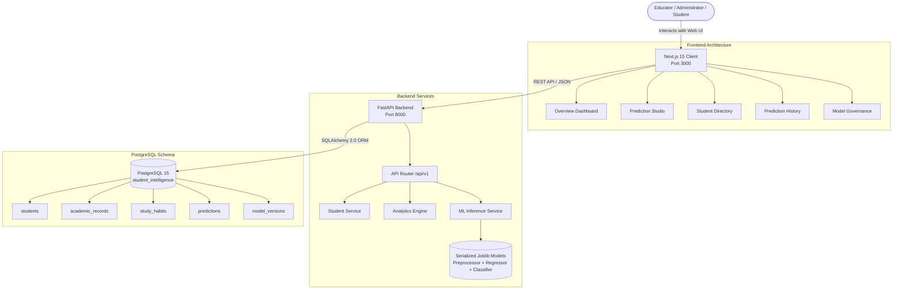

# Student Performance Intelligence System

<div align="center">


**An enterprise-grade, end-to-end Machine Learning intelligence platform for student performance forecasting, real-time risk classification, and academic cohort analytics.**

[Features](#key-features) • [Architecture](#system-architecture) • [ML Benchmarks](#machine-learning-benchmarks) • [Quick Start](#quick-start) • [API Reference](#api-reference) • [Docker Deployment](#docker-deployment)

</div>

---

## Overview

The **Student Performance Intelligence System** is an AI-powered academic analytics platform designed to give educators, administrators, and students predictive foresight into academic outcomes. By analyzing study habits, sleep schedules, historical scores, attendance rates, and behavioral features, the system delivers:

1. **Continuous Mark Forecasting:** High-precision linear and non-linear regression modeling to predict final percentage marks ($R^2 \approx 0.77$).
2. **Real-time Pass/Fail Risk Classification:** Calibrated probability scoring with Logistic Regression ($F_1 = 0.9228$, $\text{ROC-AUC} = 0.9658$) to identify at-risk students before exams occur.
3. **Interactive Scenario Simulation ("What-If" Analysis):** A dynamic Prediction Studio enabling users to manipulate study hours, sleep schedules, and attendance to observe real-time predicted outcome changes.
4. **Institutional Analytics & Cohort Tracking:** Aggregated cohort distributions, historical trends, correlation heatmaps, and individual longitudinal student portfolios.
5. **Model Registry & Governance:** Full model traceability, serialized version tracking, audit log persistence, and live performance metrics inspection.

---

## Key Features

- **Dual-Model Real-Time Inference Pipeline:**
  - Automated feature preprocessing via `scikit-learn` `ColumnTransformer` (StandardScaler for continuous features, OneHotEncoder for categorical features).
  - Parallel execution of marks prediction and pass/fail probability scoring in sub-millisecond response times.
- **Persistent Prediction Audit Logging:**
  - Every inference request is recorded in PostgreSQL with input features, predicted values, confidence probabilities, and the active model version string for strict auditability.
- **Modern Next.js 15 App Router Frontend:**
  - Responsive dark/light theme dashboard built with Tailwind CSS and Lucide icons.
  - Interactive charts powered by Recharts (correlation matrices, cohort distributions, habit vs. mark regressions).
  - Searchable, paginated student directory with modal drill-downs into full academic records and study habits.
- **Robust REST API with FastAPI & Pydantic v2:**
  - Strict input validation and boundary enforcement ($0 \le \text{marks} \le 100$, $0 \le \text{attendance} \le 100$, $0 \le \text{hours} \le 24$).
  - Full OpenAPI Swagger UI (`/docs`) and ReDoc (`/redoc`) specifications.
- **Comprehensive Test Suite & Code Quality:**
  - 20 unit and integration tests verifying database constraints, relationships, ML preprocessing, edge cases, and API routes with 100% pass rate.

---

## System Architecture



---

## Machine Learning Benchmarks

The predictive pipeline was trained and benchmarked on a verified 2,000-student dataset using 80/20 train-test splits:

### 1. Regression (Mark Prediction)
| Model | Train $R^2$ | Test $R^2$ | Test MAE | Test RMSE | Status |
| :--- | :---: | :---: | :---: | :---: | :---: |
| **Linear Regression (Baseline)** | **0.7656** | **0.7662** | **6.4533** | **7.9157** | **Active Production** |
| Random Forest Regressor | 0.9634 | 0.7457 | 6.7725 | 8.2562 | Candidate |

### 2. Classification (Pass / Fail Risk)
| Model | Accuracy | Precision | Recall | $F_1$ Score | ROC-AUC | Status |
| :--- | :---: | :---: | :---: | :---: | :---: | :---: |
| **Logistic Regression (Baseline)** | **88.50%** | **0.9067** | **0.9396** | **0.9228** | **0.9658** | **Active Production** |
| Random Forest Classifier | 87.00% | 0.8906 | 0.9131 | 0.9016 | 0.9419 | Candidate |

### Key Findings
- **Study Hours** and **Attendance** exhibit the strongest positive correlation with academic marks ($r = 0.58$ and $r = 0.54$, respectively).
- **Linear models** demonstrated superior generalization with no overfitting compared to tree-based ensembles on this feature distribution.
- All trained model weights, preprocessing transformers, and evaluation metrics are versioned under `ml/artifacts/`.

---

## Project Structure

```text
student-performance-intelligence/
├── backend/                        # FastAPI application
│   ├── app/
│   │   ├── api/v1/                 # REST API route handlers
│   │   │   ├── analytics.py        # Cohort analytics & trend endpoints
│   │   │   ├── models.py           # Model registry governance endpoints
│   │   │   ├── predictions.py      # Real-time inference endpoints
│   │   │   └── students.py         # Student CRUD endpoints
│   │   ├── config.py               # Settings & environment variables
│   │   ├── database.py             # SQLAlchemy session & engine
│   │   ├── main.py                 # FastAPI application factory & middleware
│   │   ├── models/                 # SQLAlchemy 2.0 ORM models
│   │   │   ├── academic.py         # AcademicRecord & StudyHabit models
│   │   │   ├── prediction.py       # Prediction & ModelVersion models
│   │   │   └── student.py          # Student model
│   │   ├── schemas/                # Pydantic v2 schemas
│   │   └── services/               # Core business & ML inference logic
│   │       ├── analytics_service.py
│   │       ├── ml_service.py
│   │       └── student_service.py
│   ├── migrations/                 # Alembic database migration scripts
│   ├── tests/                      # Automated Pytest test suite (20 tests)
│   ├── Dockerfile                  # Backend container build
│   └── requirements.txt            # Python dependencies
├── frontend/                       # Next.js 15 Web Application
│   ├── app/
│   │   ├── layout.tsx              # Root shell with global sidebar
│   │   ├── page.tsx                # Overview Analytics Dashboard
│   │   ├── predict/                # Prediction Studio ("What-If" Calculator)
│   │   ├── predictions/            # Historical Inference Audit Log
│   │   ├── models/                 # Model Governance Registry
│   │   └── students/               # Student Directory & Profiles
│   ├── Dockerfile                  # Frontend container build
│   └── package.json
├── ml/                             # Data Science & Machine Learning Pipeline
│   ├── artifacts/                  # Serialized pipelines (*.joblib, *.json)
│   ├── data/                       # Synthetic dataset generator & CSVs
│   │   ├── generate_dataset.py     # 2,000-student data generation script
│   │   └── student_performance_dataset.csv
│   └── src/                        # Data processing & training scripts
├── docs/                           # Architectural & Phase Documentation
│   ├── 02_ARCHITECTURE.md
│   ├── 03_DATABASE.md
│   ├── 04_EDA.md
│   ├── 05_ML_METHODOLOGY.md
│   ├── 06_API.md
│   └── eda_figures/                # High-resolution statistical plots
├── phases/                         # Detailed Phase-by-Phase Completion Specs
│   ├── PHASE_01_SETUP.md ... PHASE_10_FINAL.md
├── scripts/
│   └── seed_database.py            # PostgreSQL database seeding script
├── docker-compose.yml              # Complete multi-container orchestration
└── README.md                       # Master project documentation
```

---

## Quick Start

### Prerequisites
- Python 3.10+
- Node.js 18+ and npm
- PostgreSQL 14+ (or Docker)

### 1. Clone the Repository
```bash
git clone https://github.com/pratham01-web/student-performance-intelligence.git
cd student-performance-intelligence
```

### 2. Configure Environment Variables
Copy the template configuration:
```bash
cp .env.example .env
```
Ensure your PostgreSQL database credentials match your local setup.

---

### 3. Backend Setup & Run

1. **Create and activate a virtual environment:**
   ```bash
   cd backend
   python -m venv .venv
   
   # Windows:
   .venv\Scripts\activate
   
   # macOS/Linux:
   source .venv/bin/activate
   ```

2. **Install dependencies:**
   ```bash
   pip install -r requirements.txt
   ```

3. **Run database migrations:**
   ```bash
   alembic upgrade head
   ```

4. **Seed the database (2,000 students):**
   ```bash
   cd ..
   python scripts/seed_database.py
   cd backend
   ```

5. **Start the FastAPI backend:**
   ```bash
   uvicorn app.main:app --reload --host 0.0.0.0 --port 8000
   ```
   Backend will be running at [http://localhost:8000](http://localhost:8000).  
   Swagger UI available at [http://localhost:8000/docs](http://localhost:8000/docs).

---

### 4. Frontend Setup & Run

1. **Install frontend dependencies:**
   ```bash
   cd frontend
   npm install
   ```

2. **Launch the development server:**
   ```bash
   npm run dev
   ```
   Open [http://localhost:3000](http://localhost:3000) in your browser.

---

## Running Automated Tests

Run the full backend test suite containing 20 tests with in-memory SQLite fixtures:

```bash
cd backend
pytest tests -v
```

**Result:**
```text
backend/tests/test_analytics_api.py::test_analytics_overview PASSED
backend/tests/test_analytics_api.py::test_analytics_trends PASSED
backend/tests/test_database.py::test_metadata_contains_all_models PASSED
backend/tests/test_database.py::test_student_crud PASSED
backend/tests/test_database.py::test_student_relationships_and_cascades PASSED
backend/tests/test_database.py::test_model_version_and_prediction_audit PASSED
backend/tests/test_database.py::test_model_version_unique_constraint PASSED
backend/tests/test_database.py::test_check_constraints PASSED
backend/tests/test_database.py::test_get_db_dependency PASSED
backend/tests/test_health.py::test_health_check PASSED
backend/tests/test_ml_pipeline.py::test_preprocessor_artifact_exists_and_transforms PASSED
backend/tests/test_ml_pipeline.py::test_models_artifact_inference_invariants PASSED
backend/tests/test_ml_pipeline.py::test_preprocessor_handles_unknown_categories PASSED
backend/tests/test_predictions_api.py::test_predict_endpoint_valid_input PASSED
backend/tests/test_predictions_api.py::test_predict_marks_fast_endpoint PASSED
backend/tests/test_predictions_api.py::test_predict_pass_fail_fast_endpoint PASSED
backend/tests/test_predictions_api.py::test_predict_validation_errors PASSED
backend/tests/test_students_api.py::test_create_student_success PASSED
backend/tests/test_students_api.py::test_create_duplicate_student_code_fails PASSED
backend/tests/test_students_api.py::test_student_lifecycle_crud PASSED

======================= 20 passed in 2.50s =======================
```

---

## Docker Deployment

The entire system can be spun up in isolated containers using Docker Compose:

```bash
docker-compose up --build
```

This launches:
- **PostgreSQL Database** on port `5432` with health checking.
- **FastAPI ML Backend** on port `8000` with auto-migration.
- **Next.js Frontend Dashboard** on port `3000`.

---

## API Reference

| Method | Endpoint | Description |
| :--- | :--- | :--- |
| `GET` | `/health` | Application health and readiness check |
| `POST` | `/api/v1/predictions/predict` | Dual ML inference (marks + pass/fail) with DB audit log |
| `POST` | `/api/v1/predictions/predict-marks` | Fast single-target marks regression |
| `POST` | `/api/v1/predictions/predict-pass-fail` | Fast single-target pass/fail probability |
| `GET` | `/api/v1/predictions/history` | Paginated audit log of all historical predictions |
| `GET` | `/api/v1/students` | Search and paginate enrolled students |
| `POST` | `/api/v1/students` | Register a new student |
| `GET` | `/api/v1/students/{id}` | Student profile with academic records & study habits |
| `PUT` | `/api/v1/students/{id}` | Update student profile information |
| `DELETE` | `/api/v1/students/{id}` | Remove student (cascading deletes associated records) |
| `GET` | `/api/v1/analytics/overview` | Institutional KPI summary (average marks, pass rate) |
| `GET` | `/api/v1/analytics/trends` | Cohort performance distribution across terms |
| `GET` | `/api/v1/models` | List all registered ML model versions and metrics |
| `GET` | `/api/v1/models/active` | Current active model version details |

---

## Documentation

Comprehensive engineering documentation is available in the [`docs/`](docs/) directory:
- [02_ARCHITECTURE.md](docs/02_ARCHITECTURE.md) — System architecture, data flow, and components
- [03_DATABASE.md](docs/03_DATABASE.md) — Database schema, data dictionary, check constraints
- [04_EDA.md](docs/04_EDA.md) — Statistical exploratory analysis & distribution plots
- [05_ML_METHODOLOGY.md](docs/05_ML_METHODOLOGY.md) — Feature engineering, training, and benchmarking
- [06_API.md](docs/06_API.md) — Full API request/response specification

---

## License

This project is open source and available under the [MIT License](LICENSE).
