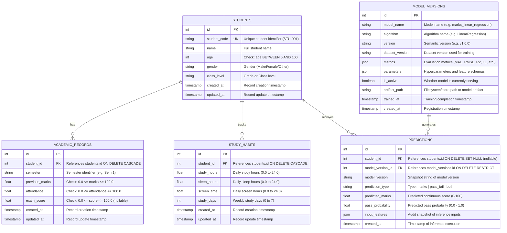

# STUDENT PERFORMANCE INTELLIGENCE SYSTEM

## Database Architecture & Data Dictionary Specification

**Document:** 03_DATABASE.md  
**Project:** Student Performance Intelligence System  
**Status:** Database Specification & Architecture Baseline  
**Version:** 1.0  

---

# 1. DATABASE OBJECTIVE

The database serves as the authoritative, persistent source of truth for the **Student Performance Intelligence System**.

It fulfills three primary system requirements:
1. **Academic Information Management:** Stores core student profiles, semester-by-semester academic metrics, and study habits.
2. **ML Model Governance & Versioning:** Tracks registered machine learning models, hyperparameters, dataset versions, evaluation metrics (MAE, RMSE, R², Accuracy, F1), and deployment status.
3. **Inference Auditability & Historical Analytics:** Records every prediction generated by the system alongside the exact input feature payload, timestamp, and model version, preventing prediction data loss and enabling longitudinal analytics.

---

# 2. ENTITY-RELATIONSHIP DIAGRAM (ERD)

---

# 3. DATA DICTIONARY

## 3.1 Table: `students`

Stores general demographic and identification details for each enrolled student.

| Column Name | PostgreSQL Type | SQLAlchemy Type | Constraints | Description |
|---|---|---|---|---|
| `id` | `SERIAL` / `INTEGER` | `Integer` | `PRIMARY KEY`, Autoincrement | Internal surrogate identifier. |
| `student_code` | `VARCHAR(32)` | `String(32)` | `UNIQUE`, `NOT NULL`, Indexed | Unique institutional student code (e.g., `STU-00101`). |
| `name` | `VARCHAR(128)` | `String(128)` | `NOT NULL` | Full student name. |
| `age` | `INTEGER` | `Integer` | `NOT NULL`, `CHECK (age >= 5 AND age <= 100)` | Student age in completed years. |
| `gender` | `VARCHAR(16)` | `String(16)` | `NOT NULL` | Student gender (e.g., `Male`, `Female`, `Other`). |
| `class_level` | `VARCHAR(32)` | `String(32)` | `NOT NULL` | Enrolled grade, division, or class level. |
| `created_at` | `TIMESTAMPTZ` | `DateTime(timezone=True)` | `NOT NULL`, Default: `now()` | Record creation timestamp. |
| `updated_at` | `TIMESTAMPTZ` | `DateTime(timezone=True)` | `NOT NULL`, Default: `now()` | Record last modification timestamp. |

**Indexes:**
- `ix_students_student_code`: B-Tree index on `student_code` for fast lookups by student ID.

**Relationships:**
- One-to-many with `academic_records` (`cascade="all, delete-orphan"`).
- One-to-many with `study_habits` (`cascade="all, delete-orphan"`).
- One-to-many with `predictions` (`back_populates="student"`).

---

## 3.2 Table: `academic_records`

Maintains longitudinal academic records, past performance marks, and attendance records per semester.

| Column Name | PostgreSQL Type | SQLAlchemy Type | Constraints | Description |
|---|---|---|---|---|
| `id` | `SERIAL` / `INTEGER` | `Integer` | `PRIMARY KEY`, Autoincrement | Record surrogate identifier. |
| `student_id` | `INTEGER` | `Integer` | `NOT NULL`, `FOREIGN KEY (students.id) ON DELETE CASCADE`, Indexed | Parent student identifier. |
| `semester` | `VARCHAR(32)` | `String(32)` | `NOT NULL` | Semester designation (e.g. `Semester 1`, `Term 2`). |
| `previous_marks` | `FLOAT` / `DOUBLE PRECISION` | `Float` | `NOT NULL`, `CHECK (previous_marks >= 0.0 AND previous_marks <= 100.0)` | Prior term marks percentage (0.0 – 100.0). |
| `attendance` | `FLOAT` / `DOUBLE PRECISION` | `Float` | `NOT NULL`, `CHECK (attendance >= 0.0 AND attendance <= 100.0)` | Cumulative attendance percentage (0.0 – 100.0). |
| `exam_score` | `FLOAT` / `DOUBLE PRECISION` | `Float` | `NULLABLE`, `CHECK (exam_score >= 0.0 AND exam_score <= 100.0)` | Final realized examination score (if evaluated). |
| `created_at` | `TIMESTAMPTZ` | `DateTime(timezone=True)` | `NOT NULL`, Default: `now()` | Record creation timestamp. |
| `updated_at` | `TIMESTAMPTZ` | `DateTime(timezone=True)` | `NOT NULL`, Default: `now()` | Record last modification timestamp. |

**Indexes:**
- `ix_academic_records_student_id`: B-Tree index on `student_id` for efficient joined queries.

---

## 3.3 Table: `study_habits`

Captures lifestyle, study duration, sleep duration, and digital distraction metrics used as features in prediction models.

| Column Name | PostgreSQL Type | SQLAlchemy Type | Constraints | Description |
|---|---|---|---|---|
| `id` | `SERIAL` / `INTEGER` | `Integer` | `PRIMARY KEY`, Autoincrement | Record surrogate identifier. |
| `student_id` | `INTEGER` | `Integer` | `NOT NULL`, `FOREIGN KEY (students.id) ON DELETE CASCADE`, Indexed | Parent student identifier. |
| `study_hours` | `FLOAT` | `Float` | `NOT NULL`, `CHECK (study_hours >= 0.0 AND study_hours <= 24.0)` | Average daily dedicated study hours. |
| `sleep_hours` | `FLOAT` | `Float` | `NOT NULL`, `CHECK (sleep_hours >= 0.0 AND sleep_hours <= 24.0)` | Average daily hours of sleep. |
| `screen_time` | `FLOAT` | `Float` | `NULLABLE`, `CHECK (screen_time >= 0.0 AND screen_time <= 24.0)` | Average daily recreational screen time in hours. |
| `study_days` | `INTEGER` | `Integer` | `NULLABLE`, `CHECK (study_days >= 0 AND study_days <= 7)` | Active study days per week (0 to 7). |
| `created_at` | `TIMESTAMPTZ` | `DateTime(timezone=True)` | `NOT NULL`, Default: `now()` | Record creation timestamp. |
| `updated_at` | `TIMESTAMPTZ` | `DateTime(timezone=True)` | `NOT NULL`, Default: `now()` | Record last modification timestamp. |

**Indexes:**
- `ix_study_habits_student_id`: B-Tree index on `student_id`.

---

## 3.4 Table: `model_versions`

Provides an auditable ML model registry tracking model metadata, algorithm types, dataset versions, and evaluation metrics.

| Column Name | PostgreSQL Type | SQLAlchemy Type | Constraints | Description |
|---|---|---|---|---|
| `id` | `SERIAL` / `INTEGER` | `Integer` | `PRIMARY KEY`, Autoincrement | Registry surrogate identifier. |
| `model_name` | `VARCHAR(100)` | `String(100)` | `NOT NULL`, Indexed | Model identifier (e.g. `marks_predictor`). |
| `algorithm` | `VARCHAR(100)` | `String(100)` | `NOT NULL` | Underlying algorithm (e.g. `LinearRegression`). |
| `version` | `VARCHAR(50)` | `String(50)` | `NOT NULL` | Semantic release version (e.g. `v1.0.0`). |
| `dataset_version` | `VARCHAR(50)` | `String(50)` | `NOT NULL` | Version identifier of dataset used for training. |
| `metrics` | `JSON` / `JSONB` | `JSON` | `NOT NULL` | Evaluation metrics JSON payload (`{"mae": 3.4, "r2": 0.86}`). |
| `parameters` | `JSON` / `JSONB` | `JSON` | `NULLABLE` | Hyperparameters and feature specification. |
| `is_active` | `BOOLEAN` | `Boolean` | `NOT NULL`, Default: `FALSE` | Active production status flag. |
| `artifact_path` | `VARCHAR(255)` | `String(255)` | `NULLABLE` | Relative path to serialized joblib/pickle artifact. |
| `trained_at` | `TIMESTAMPTZ` | `DateTime(timezone=True)` | `NOT NULL`, Default: `now()` | Timestamp when model completed training. |
| `created_at` | `TIMESTAMPTZ` | `DateTime(timezone=True)` | `NOT NULL`, Default: `now()` | Registration timestamp. |

**Constraints & Indexes:**
- `uq_model_versions_name_version`: Unique constraint across `(model_name, version)`.
- `ix_model_versions_is_active`: Index on `is_active` for rapid retrieval of current production models.

---

## 3.5 Table: `predictions`

Logs every prediction event generated by backend ML services for full reproducibility, historical analytics, and audits.

| Column Name | PostgreSQL Type | SQLAlchemy Type | Constraints | Description |
|---|---|---|---|---|
| `id` | `SERIAL` / `INTEGER` | `Integer` | `PRIMARY KEY`, Autoincrement | Prediction surrogate identifier. |
| `student_id` | `INTEGER` | `Integer` | `NULLABLE`, `FOREIGN KEY (students.id) ON DELETE SET NULL`, Indexed | Associated student, or NULL if anonymous/adhoc. |
| `model_version_id` | `INTEGER` | `Integer` | `NULLABLE`, `FOREIGN KEY (model_versions.id) ON DELETE RESTRICT`, Indexed | Model registry reference. |
| `model_version` | `VARCHAR(50)` | `String(50)` | `NOT NULL` | Snapshot string of model version for audit stability. |
| `prediction_type` | `VARCHAR(32)` | `String(32)` | `NOT NULL` | Inference type (`marks`, `pass_fail`, or `both`). |
| `predicted_marks` | `FLOAT` | `Float` | `NULLABLE`, `CHECK (predicted_marks >= 0.0 AND predicted_marks <= 100.0)` | Predicted marks score (0.0 to 100.0). |
| `pass_probability` | `FLOAT` | `Float` | `NULLABLE`, `CHECK (pass_probability >= 0.0 AND pass_probability <= 1.0)` | Probability of passing (0.0 to 1.0). |
| `input_features` | `JSON` / `JSONB` | `JSON` | `NOT NULL` | Exact feature key-value payload supplied to the model. |
| `created_at` | `TIMESTAMPTZ` | `DateTime(timezone=True)` | `NOT NULL`, Default: `now()`, Indexed | Inference timestamp. |

**Indexes:**
- `ix_predictions_student_id`: For student prediction history queries.
- `ix_predictions_model_version_id`: For model-specific prediction auditing.
- `ix_predictions_created_at`: For time-range filtering and analytics.

---

# 4. DATABASE INTEGRITY & POLICIES

### 4.1 Cascading Deletion Strategy
- **Student Profile Deletion:** When a `Student` record is deleted, all child `AcademicRecord` and `StudyHabit` records are permanently removed (`ON DELETE CASCADE`) to preserve referential clean-up without orphans.
- **Prediction Preservation:** Existing predictions for deleted students retain historical data (`ON DELETE SET NULL`), detaching `student_id` while preserving `input_features`, timestamp, and predicted scores for institutional reporting.

### 4.2 Model Version Safety
- Model records referenced in the `predictions` table cannot be inadvertently deleted (`ON DELETE RESTRICT`). Any active or historical model that has logged inference predictions is locked against destructive deletions.

### 4.3 Auditing & Reproducibility
- In accordance with `AGENTS.md` Rule 5 ("No fake ML") and Rule 11 ("Model versioning"), every row in `predictions` captures:
  1. The exact model version (`model_version`).
  2. The exact dictionary of input feature values (`input_features`).
  3. The resulting predictions and probabilities.

---

# 5. CONNECTION POOLING & CONFIGURATION

- Engine initialization enables `pool_pre_ping=True` to prevent stale connection drops.
- Configurable pool sizes (`pool_size=10`, `max_overflow=20`) support concurrent request execution.
- Dependency injection pattern via FastAPI's `Depends(get_db)` guarantees deterministic session teardown.
